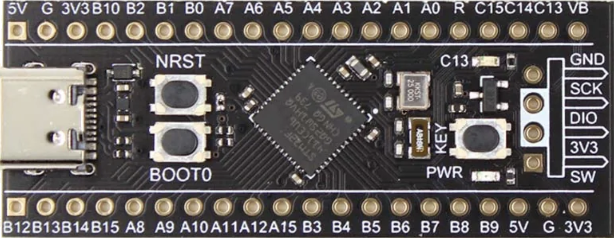
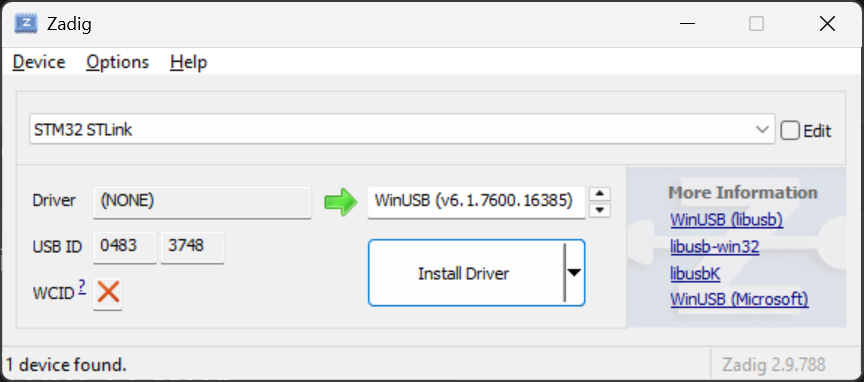

# STM32F411CEU6 Black Pill

The **STM32F411CEU6** is a high-performance **Cortex-M4F-based microcontroller**.



## Specifications

| **Feature**                   | **Details**                 |
|-------------------------------|-----------------------------|
| **CPU Core**                  | ARM Cortex-M4F (100MHz)     |
| **Floating-Point Unit (FPU)** | Yes (Single-precision)      |
| **Flash Memory**              | 512 KB                      |
| **RAM**                       | 128 KB                      |
| **GPIO Pins**                 | 37 (5V-tolerant)            |
| **PWM Outputs**               | 12 (Supports Motor Control) |
| **I2C Interfaces**            | 3                           |
| **SPI Interfaces**            | 3                           |
| **UART Interfaces**           | 3                           |
| **USB Support**               | Full-Speed USB 2.0          |
| **Bootloader Support**        | DFU (USB) & UART            |
| **Power Supply**              | 3.3V                        |
| **Target**                    | `thumbv7em-none-eabihf`     |

## Memory Layout (`memory.x`)

The `memory.x` linker script defines the **Flash and RAM addresses** for the STM32F411:

```text
MEMORY
{
  FLASH : ORIGIN = 0x08000000, LENGTH = 512K
  RAM   : ORIGIN = 0x20000000, LENGTH = 128K
}
```

# Programming the STM32F411 Black Pill

This project is written in **Rust** and is meant to be flashed to the STM32F411CEU6 Black Pill.

There are two common ways to program the board:

1. **ST-LINK V2 over SWD**: recommended for development and debugging.
2. **USB-C using DFU bootloader mode**: useful when flashing directly through the board USB-C port.

## Using ST-LINK V2 (SWD)

### 1. Install the Rust target

```shell
rustup target add thumbv7em-none-eabihf
```

### 2. Project dependencies

`Cargo.toml` should include:

```toml
[dependencies]
cortex-m = "0.7.7"
cortex-m-rt = "0.7.5"
panic-halt = "1.0.0"

# STM32F411 HAL (Hardware Abstraction Layer)
[dependencies.stm32f4xx-hal]
version = "0.22.1"
features = ["stm32f411"]
```

### 3. Cargo configuration

`.cargo/config.toml` should include:

```toml
[build]
target = "thumbv7em-none-eabihf"

[target.thumbv7em-none-eabihf]
runner = "probe-rs run --chip STM32F411CEU6"
rustflags = ["-C", "link-arg=-Tlink.x"]
```

### 4. Install `probe-rs` tools

`cargo-flash` is now part of `probe-rs`. Do **not** install it with:

```shell
cargo install cargo-flash
```

On Windows PowerShell, install the `probe-rs` tools with:

```powershell
irm https://github.com/probe-rs/probe-rs/releases/latest/download/probe-rs-tools-installer.ps1 | iex
```

After installation, close and reopen PowerShell, then check:

```powershell
probe-rs --version
cargo flash --version
```

### 5. ST-LINK driver on Windows

If this command:

```powershell
probe-rs list
```

returns:

```text
No debug probes were found.
```

but **STM32 STLink** appears in Windows Device Manager with a yellow warning triangle, the ST-LINK driver is missing or incorrect.

Fix it with **Zadig**:

1. Open Zadig.
2. Go to **Options > List All Devices**.
3. Select **STM32 STLink**.
4. Select **WinUSB** as the driver.
5. Click **Install Driver** or **Replace Driver**.
6. Unplug and replug the ST-LINK.
7. Run `probe-rs list` again.



A working ST-LINK usually appears with USB ID:

```text
[0]: STLink V2 -- 0483:3748:3A001E00182D343632525544 (ST-LINK)
```

### 6. Connect the ST-LINK to the Black Pill

Use SWD wiring:

```text
ST-LINK V2      Black Pill
3.3V       ->   3.3V
GND        ->   GND
SWDIO      ->   SWDIO / DIO
SWCLK      ->   SWCLK / CLK
NRST       ->   RST   (optional)
```

Use **3.3V**, not 5V, unless you are sure your board expects 5V on that pin.

### 7. Flash the blink example

For normal flashing, use `cargo flash`:

```shell
cargo flash --example blink --chip STM32F411CEUx
```

The physical chip on the board is **STM32F411CEU6**, but `probe-rs` uses the generic chip database name **STM32F411CEUx**. Using `STM32F411CEU6` may still work, but it can give a wildcard matching warning.

You can also use the configured `probe-rs` runner:

```shell
cargo run --example blink
```

This also flashes the firmware, but it keeps the `probe-rs` session attached after programming. For an embedded program such as `blink`, this can look like the command is hanging because the firmware runs forever in a loop. Stop it with `Ctrl + C` when needed.

## Using the USB-C port

This method flashes firmware directly via USB-C, without an ST-LINK, using DFU bootloader mode.

For USB-C flashing, the board must be put into **DFU bootloader mode** first. This is different from the ST-LINK method above. `probe-rs list` only detects debug probes such as ST-LINK, J-Link, or CMSIS-DAP. It does not list the Black Pill itself when it is only connected by USB-C.
